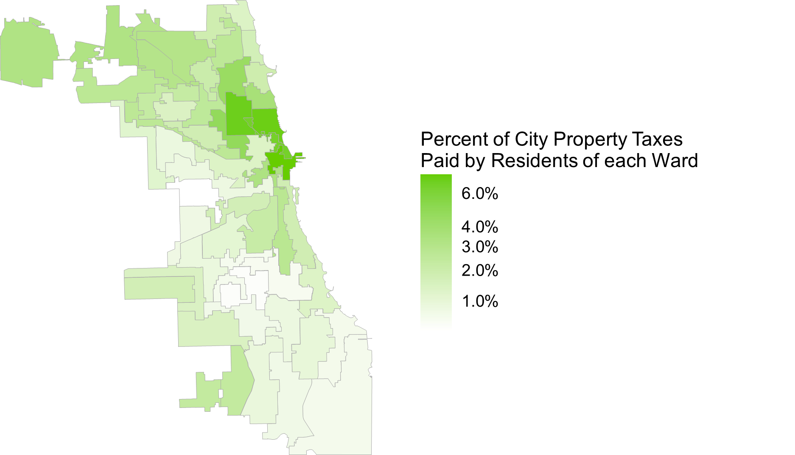

```{r, echo=FALSE, fig.align='center', out.width='50%'}

```


# Overview

In Cook County and the City of Chicago, all properties pay taxes to
support various governments. Municipal taxing bodies from the City of
Chicago to the Chicago Public Schools (CPS) to Cook County Government
all levy property taxes that are mechanistically comparable. The tax
bill of a property is based on its assessed value, the levies of the
taxing bodies it pays into, and the assessed values of the other
properties in those taxing bodies.

Below is shown a ward map, with each ward shaded by the percentage of
the total tax burden paid by residential taxpayers in it.

```{r, echo=FALSE, fig.align='center', out.width='80%'}

```


## Select Your Ward

```{r, echo=FALSE, results='asis'}
options_html <- paste0('<option value="reports/Ward_', 1:50, '_Report.pdf">Ward ', 1:50, '</option>', collapse = "\n")

cat(paste0('
<select id="redirect-menu" style="font-size: 20px; padding: 5px;" onchange="openInNewTab(this.value)">
  <option value="" selected disabled>Select your ward!</option>',
  options_html,
  '
</select>

<script>
function openInNewTab(url) {
  if (url) {
    window.open(url, "_blank");
    document.getElementById("redirect-menu").selectedIndex = 0;
  }
}
</script>
'))
```

